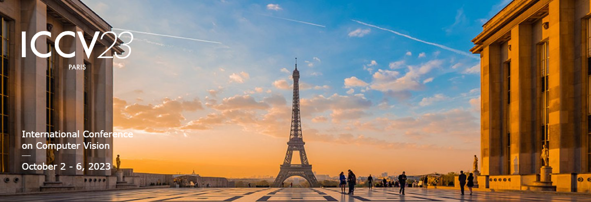

# ICCV-2023-Papers

## 官网链接：https://iccv2023.thecvf.com/

### 研讨会:bell:：2023 年 10 月 2 日至 3 日 
### 主会:bell:：2023 年 10 月 4 日至 6 日

## 历年综述论文分类汇总戳这里↘️[CV-Surveys](https://github.com/52CV/CV-Surveys)施工中~~~~~~~~~~

## 2023 年论文分类汇总戳这里
↘️[CVPR-2023-Papers](https://github.com/52CV/CVPR-2023-Papers)
↘️[WACV-2023-Papers](https://github.com/52CV/WACV-2023-Papers)
↘️[ICCV-2023-Papers](https://github.com/52CV/ICCV-2023-Papers)

## 2022 年论文分类汇总戳这里
↘️[CVPR-2022-Papers](https://github.com/52CV/CVPR-2022-Papers)
↘️[WACV-2022-Papers](https://github.com/52CV/WACV-2022-Papers)
↘️[ECCV-2022-Papers](https://github.com/52CV/ECCV-2022-Papers)

## 2021年论文分类汇总戳这里
↘️[ICCV-2021-Papers](https://github.com/52CV/ICCV-2021-Papers)
↘️[CVPR-2021-Papers](https://github.com/52CV/CVPR-2021-Papers)

## 2020 年论文分类汇总戳这里
↘️[CVPR-2020-Papers](https://github.com/52CV/CVPR-2020-Papers)
↘️[ECCV-2020-Papers](https://github.com/52CV/ECCV-2020-Papers)

计216+27 篇。 

## 目录

|:cat:|:dog:|:tiger:|:wolf:|
|------|------|------|------|

 :house:[project]
 :star:[code]
 :thumbsup:

## View Synthesis(视图合成)
* [LoLep: Single-View View Synthesis with Locally-Learned Planes and Self-Attention Occlusion Inference](http://arxiv.org/abs/2307.12217v1)
* [Learning Unified Decompositional and Compositional NeRF for Editable Novel View Synthesis](http://arxiv.org/abs/2308.02840v1) :star:[code](https://w-ted.github.io/publications/udc-nerf)

## Image Matching(图像匹配)
* [OccNet: Robust Image Matching Based on 3D Occupancy Estimation for Occluded Regions]未公开

## Image Fusion(图像融合)
* [MEFLUT: Unsupervised 1D Lookup Tables for Multi-exposure Image Fusion]未公开

## Image-to-Image Translation
* [General Image-to-Image Translation with One-Shot Image Guidance](http://arxiv.org/abs/2307.14352v1) :star:[code](https://github.com/CrystalNeuro/visual-concept-translator)

## Edge Detection
* [Tiny and Efficient Model for the Edge Detection Generalization](http://arxiv.org/abs/2308.06468v1) :star:[code](https://github.com/xavysp/TEED)

## Scene Graph Generation(场景图合成)
* [Environment-Invariant Curriculum Relation Learning for Fine-Grained Scene Graph Generation](http://arxiv.org/abs/2308.03282v1)
* [Compositional Feature Augmentation for Unbiased Scene Graph Generation](http://arxiv.org/abs/2308.06712v1)

## Neural Radiance Fields
* [Seal-3D: Interactive Pixel-Level Editing for Neural Radiance Fields](http://arxiv.org/abs/2307.15131v1) :house:[project](https://windingwind.github.io/seal-3d/) :star:[code](https://github.com/windingwind/seal-3d/)
* [WaveNeRF: Wavelet-based Generalizable Neural Radiance Fields](http://arxiv.org/abs/2308.04826v1)
* Rendering(渲染)
  * [DNA-Rendering: A Diverse Neural Actor Repository for High-Fidelity Human-centric Rendering](https://arxiv.org/abs/2307.10173) :house:[project](https://dna-rendering.github.io/)
  * [S3IM: Stochastic Structural SIMilarity and Its Unreasonable Effectiveness for Neural Fields](http://arxiv.org/abs/2308.07032v1) :star:[code](https://github.com/Madaoer/S3IM)
  * [TransHuman: A Transformer-based Human Representation for Generalizable Neural Human Rendering](http://arxiv.org/abs/2307.12291v1) :star:[code](https://pansanity666.github.io/TransHuman/)
  * [Tri-MipRF: Tri-Mip Representation for Efficient Anti-Aliasing Neural Radiance Fields](http://arxiv.org/abs/2307.11335v1) :star:[code](https://wbhu.github.io/projects/Tri-MipRF)
  * [Rendering Humans from Object-Occluded Monocular Videos](http://arxiv.org/abs/2308.04622v1) :house:[project](https://cs.stanford.edu/~xtiange/projects/occnerf/)
* 新视图合成
  * [Urban Radiance Field Representation with Deformable Neural Mesh Primitives](http://arxiv.org/abs/2307.10776v1) :house:[project](https://dnmp.github.io/)
* 版权保护
  * [CopyRNeRF: Protecting the CopyRight of Neural Radiance Fields](http://arxiv.org/abs/2307.11526v1)

## Dataset/Benchmark
* 数据集
  * [Building3D: An Urban-Scale Dataset and Benchmarks for Learning Roof Structures from Point Clouds](https://arxiv.org/pdf/2307.11914.pdf) :sunflower:[dataset](https://building3d.ucalgary.ca/#) :thumbsup:[ICCV2023 首个城市级别的基于航空点云的房屋建模数据集 Building3D](https://mp.weixin.qq.com/s/gKFByZ8ud2aNlG7C7t2-2Q)
  * [Learning Optical Flow from Event Camera with Rendered Dataset](https://arxiv.org/abs/2303.11011)
  * [Efficient neural supersampling on a novel gaming dataset](http://arxiv.org/abs/2308.01483v1)
  * [AIDE: A Vision-Driven Multi-View, Multi-Modal, Multi-Tasking Dataset for Assistive Driving Perception](http://arxiv.org/abs/2307.13933v1) :star:[code](https://github.com/ydk122024/AIDE)
  * [360VOT: A New Benchmark Dataset for Omnidirectional Visual Object Tracking](http://arxiv.org/abs/2307.14630v1) :house:[project](https://360vot.hkustvgd.com) :star:[code](https://github.com/HuajianUP/360VOT)全向视觉目标跟踪
* 基准
  * [From Sky to the Ground: A Large-scale Benchmark and Simple Baseline Towards Real Rain Removal](http://arxiv.org/abs/2308.03867v1)
  * 目标检测
    * [COCO-O: A Benchmark for Object Detectors under Natural Distribution Shifts](http://arxiv.org/abs/2307.12730v1) :star:[code](https://github.com/alibaba/easyrobust/tree/main/benchmarks/coco_o)
  * 超分辨率  
    * [A Benchmark for Chinese-English Scene Text Image Super-resolution](http://arxiv.org/abs/2308.03262v1) :star:[code](https://github.com/mjq11302010044/Real-CE)

## Vision Transformers
* [Pre-training Vision Transformers with Very Limited Synthesized Images](http://arxiv.org/abs/2307.14710v1)
* [SMMix: Self-Motivated Image Mixing for Vision Transformers](https://arxiv.org/abs/2212.12977)
* [Revisiting Vision Transformer from the View of Path Ensemble](http://arxiv.org/abs/2308.06548v1)

## Anomaly Detection(异常检测)
* 图像异常检测
  * [Focus the Discrepancy: Intra- and Inter-Correlation Learning for Image Anomaly Detection](http://arxiv.org/abs/2308.02983v1) :star:[code](https://github.com/xcyao00/FOD)

## Vision-Language
* [Regularized Mask Tuning: Uncovering Hidden Knowledge in Pre-trained Vision-Language Models](http://arxiv.org/abs/2307.15049v1) :star:[code](https://wuw2019.github.io/RMT/)
* [Why Is Prompt Tuning for Vision-Language Models Robust to Noisy Labels?](http://arxiv.org/abs/2307.11978v1) :star:[code](https://github.com/CEWu/PTNL)
* [Set-level Guidance Attack: Boosting Adversarial Transferability of Vision-Language Pre-training Models](http://arxiv.org/abs/2307.14061v1)
* [CTP: Towards Vision-Language Continual Pretraining via Compatible Momentum Contrast and Topology Preservation](http://arxiv.org/abs/2308.07146v1) :star:[code](https://github.com/KevinLight831/CTP)
* 视觉表示学习
  * [Hallucination Improves the Performance of Unsupervised Visual Representation Learning](http://arxiv.org/abs/2307.12168v1)
* VLN
  * [Learning Vision-and-Language Navigation from YouTube Videos](http://arxiv.org/abs/2307.11984v1) :star:[code](https://github.com/JeremyLinky/YouTube-VLN)
  * [GridMM: Grid Memory Map for Vision-and-Language Navigation](http://arxiv.org/abs/2307.12907v1)
  * [Scaling Data Generation in Vision-and-Language Navigation](http://arxiv.org/abs/2307.15644v1)
  * [Bird's-Eye-View Scene Graph for Vision-Language Navigation](http://arxiv.org/abs/2308.04758v1) :star:[code](https://github.com/DefaultRui/BEV-Scene-Graph)
  * [AerialVLN: Vision-and-Language Navigation for UAVs](http://arxiv.org/abs/2308.06735v1) :star:[code](https://github.com/AirVLN/AirVLN)

## Object Pose Estimation
* 6D
  * [Deep Fusion Transformer Network with Weighted Vector-Wise Keypoints Voting for Robust 6D Object Pose Estimation](http://arxiv.org/abs/2308.05438v1)

## Vision Question Answering(视觉问答)
* Video-QA
  * [Discovering Spatio-Temporal Rationales for Video Question Answering](http://arxiv.org/abs/2307.12058v1) :star:[code](https://github.com/yl3800/TranSTR)

## Action Detection
* [Masked Motion Predictors are Strong 3D Action Representation Learners](http://arxiv.org/abs/2308.07092v1) :star:[code](https://github.com/maoyunyao/MAMP)
* 时序动作定位
  * [DDG-Net: Discriminability-Driven Graph Network for Weakly-supervised Temporal Action Localization](http://arxiv.org/abs/2307.16415v1) :star:[code](https://github.com/XiaojunTang22/ICCV2023-DDGNet)

## Video
* [D3G: Exploring Gaussian Prior for Temporal Sentence Grounding with Glance Annotation](http://arxiv.org/abs/2308.04197v1) :star:[code](https://github.com/solicucu/D3G)
* 视频稳定
  * [Fast Full-frame Video Stabilization with Iterative Optimization](http://arxiv.org/abs/2307.12774v1)
* Video Grounding(视频定位)
  * [G2L: Semantically Aligned and Uniform Video Grounding via Geodesic and Game Theory](http://arxiv.org/abs/2307.14277v1)
  * [UniVTG: Towards Unified Video-Language Temporal Grounding](http://arxiv.org/abs/2307.16715v1) :star:[code](https://github.com/showlab/UniVTG)
  * [Knowing Where to Focus: Event-aware Transformer for Video Grounding](http://arxiv.org/abs/2308.06947v1) :star:[code](https://github.com/jinhyunj/EaTR)
* 视频分割
  * [XMem++: Production-level Video Segmentation From Few Annotated Frames](http://arxiv.org/abs/2307.15958v1)
* 视频对应
  * [Learning Fine-Grained Features for Pixel-wise Video Correspondences](http://arxiv.org/abs/2308.03040v1) :star:[code](https://github.com/qianduoduolr/FGVC)

## 手语
* [Gloss-free Sign Language Translation: Improving from Visual-Language Pretraining](http://arxiv.org/abs/2307.14768v1) :star:[code](https://github.com/zhoubenjia/GFSLT-VLP)

## Human-Object Interaction(人物交互)
* [Persistent-Transient Duality: A Multi-mechanism Approach for Modeling Human-Object Interaction](http://arxiv.org/abs/2307.12729v1)
* [Re-mine, Learn and Reason: Exploring the Cross-modal Semantic Correlations for Language-guided HOI detection](http://arxiv.org/abs/2307.13529v1)

## SLAM/Augmented Reality/Virtual Reality/Robotics(增强/虚拟现实/机器人)
* 虚拟人物生成
  * [MODA: Mapping-Once Audio-driven Portrait Animation with Dual Attentions](http://arxiv.org/abs/2307.10008v1)

## Autonomous vehicles(自动驾驶)
* 自动驾驶
  * [Improving Online Lane Graph Extraction by Object-Lane Clustering](http://arxiv.org/abs/2307.10947v1)
  * [DriveAdapter: Breaking the Coupling Barrier of Perception and Planning in End-to-End Autonomous Driving](http://arxiv.org/abs/2308.00398v1) :star:[code](https://github.com/OpenDriveLab/DriveAdapter)
* 轨迹预测
  * [ADAPT: Efficient Multi-Agent Trajectory Prediction with Adaptation](http://arxiv.org/abs/2307.14187v1) :star:[code](https://KUIS-AI.github.io/adapt)
* 车道线
  * [PETRv2: A Unified Framework for 3D Perception from Multi-Camera Images](https://arxiv.org/pdf/2206.01256.pdf) :star:[code](https://github.com/megvii-research/PETR.git)
  * [LATR: 3D Lane Detection from Monocular Images with Transformer](http://arxiv.org/abs/2308.04583v1) :star:[code](https://github.com/JMoonr/LATR)

## Style Transfer(风格迁移)
* [AesPA-Net: Aesthetic Pattern-Aware Style Transfer Networks](http://arxiv.org/abs/2307.09724v1) :star:[code](https://github.com/Kibeom-Hong/AesPA-Net)
* [Creative Birds: Self-Supervised Single-View 3D Style Transfer](http://arxiv.org/abs/2307.14127v1) :star:[code](https://github.com/wrk226/2D-to-3D-Evolution-Transfer)

## Semi-Supervised Learning
* 半监督学习
  * [Shrinking Class Space for Enhanced Certainty in Semi-Supervised Learning](http://arxiv.org/abs/2308.06777v1) :star:[code](https://github.com/LiheYoung/ShrinkMatch)

## Machine Learning(机器学习)
* Adversarial Learning(对抗学习) 
  * [ACTIVE: Towards Highly Transferable 3D Physical Camouflage for Universal and Robust Vehicle Evasion](http://arxiv.org/abs/2308.07009v1) :star:[code](https://islab-ai.github.io/active-iccv2023/)
  * [Towards Building More Robust Models with Frequency Bias](http://arxiv.org/abs/2307.09763v1)
  * 黑盒
    * [CGBA: Curvature-aware Geometric Black-box Attack](https://arxiv.org/abs/2308.03163) :star:[code](https://github.com/Farhamdur/CGBA)
  * 对抗样本
    * [Downstream-agnostic Adversarial Examples](http://arxiv.org/abs/2307.12280v1)
    * [Benchmarking and Analyzing Robust Point Cloud Recognition: Bag of Tricks for Defending Adversarial Examples](http://arxiv.org/abs/2307.16361v1) :star:[code](https://github.com/qiufan319/benchmark_pc_attack.git)
  * 对抗攻击
    * [An Adaptive Model Ensemble Adversarial Attack for Boosting Adversarial Transferability](http://arxiv.org/abs/2308.02897v1)
  * 对抗训练  
    * [Improving Generalization of Adversarial Training via Robust Critical Fine-Tuning](http://arxiv.org/abs/2308.02533v1) :star:[code](https://github.com/microsoft/robustlearn)  
* Class Incremental Learning(类增量学习)
  * [Proxy Anchor-based Unsupervised Learning for Continuous Generalized Category Discovery](http://arxiv.org/abs/2307.10943v1)
  * [Heterogeneous Forgetting Compensation for Class-Incremental Learning](http://arxiv.org/abs/2308.03374v1) :star:[code](https://github.com/JiahuaDong/HFC)
* 多任务学习
  * [MAS: Towards Resource-Efficient Federated Multiple-Task Learning](http://arxiv.org/abs/2307.11285v1)
  * [TaskExpert: Dynamically Assembling Multi-Task Representations with Memorial Mixture-of-Experts](http://arxiv.org/abs/2307.15324v1) :star:[code](https://github.com/prismformore/Multi-Task-Transformer)
* 持续学习/增量学习
  * [CLR: Channel-wise Lightweight Reprogramming for Continual Learning](http://arxiv.org/abs/2307.11386v1) :star:[code](https://github.com/gyhandy/Channel-wise-Lightweight-Reprogramming)
  * [Online Prototype Learning for Online Continual Learning](http://arxiv.org/abs/2308.00301v1) :star:[code](https://github.com/weilllllls/OnPro)
  * [CBA: Improving Online Continual Learning via Continual Bias Adaptor](http://arxiv.org/abs/2308.06925v1)
* Federated Learning(联邦学习)
  * [ProtoFL: Unsupervised Federated Learning via Prototypical Distillation](http://arxiv.org/abs/2307.12450v1)
* Reinforcement Learning(强化学习)
  * [Improving Generalization in Visual Reinforcement Learning via Conflict-aware Gradient Agreement Augmentation](http://arxiv.org/abs/2308.01194v1)
* 迁移学习
  * [Prototypes-oriented Transductive Few-shot Learning with Conditional Transport](http://arxiv.org/abs/2308.03047v1)

## Model Compression/Knowledge Distillation/Pruning(模型压缩/知识蒸馏/剪枝)
* 量化
  * [EMQ: Evolving Training-free Proxies for Automated Mixed Precision Quantization](http://arxiv.org/abs/2307.10554v1)
* 剪枝
  * [Unified Data-Free Compression: Pruning and Quantization without Fine-Tuning](http://arxiv.org/abs/2308.07209v1)
* 轻量级网络
  * [Adaptive Frequency Filters As Efficient Global Token Mixers](http://arxiv.org/abs/2307.14008v1)
* 知识蒸馏
  * [DOT: A Distillation-Oriented Trainer](https://arxiv.org/abs/2307.08436)
  * [Cumulative Spatial Knowledge Distillation for Vision Transformers](https://arxiv.org/abs/2307.08500)
  * [Multi-Label Knowledge Distillation](http://arxiv.org/abs/2308.06453v1) :star:[code](https://github.com/penghui-yang/L2D)

## Few/Zero-Shot Learning/Domain Generalization/Adaptation(小/零样本/域泛化/域适应)
* 域适应
  * [Unsupervised Accuracy Estimation of Deep Visual Models using Domain-Adaptive Adversarial Perturbation without Source Samples](http://arxiv.org/abs/2307.10062v1)
* 域泛化
  * [Flatness-Aware Minimization for Domain Generalization](http://arxiv.org/abs/2307.11108v1)
  * [PromptStyler: Prompt-driven Style Generation for Source-free Domain Generalization](http://arxiv.org/abs/2307.15199v1) :house:[project](https://promptstyler.github.io/)
* 零样本学习
  * [Hierarchical Visual Primitive Experts for Compositional Zero-Shot Learning](http://arxiv.org/abs/2308.04016v1) :star:[code](https://github.com/HanjaeKim98/CoT)

## Optical Flow Estimation(光流估计)
* [GAFlow: Incorporating Gaussian Attention into Optical Flow]未公开
* [Explicit Motion Disentangling for Efficient Optical Flow Estimation]未公开

## Point Cloud(点云)
* [SC3K: Self-supervised and Coherent 3D Keypoints Estimation from Rotated, Noisy, and Decimated Point Cloud Data](http://arxiv.org/abs/2308.05410v1) :star:[code](https://github.com/IITPAVIS/SC3K)
* [2D3D-MATR: 2D-3D Matching Transformer for Detection-free Registration between Images and Point Clouds](http://arxiv.org/abs/2308.05667v1) :star:[code](https://github.com/minhaolee/2D3DMATR)
* [DELFlow: Dense Efficient Learning of Scene Flow for Large-Scale Point Clouds](http://arxiv.org/abs/2308.04383v1) :star:[code](https://github.com/IRMVLab/DELFlow)
* [Sketch and Text Guided Diffusion Model for Colored Point Cloud Generation](http://arxiv.org/abs/2308.02874v1)
* [Clustering based Point Cloud Representation Learning for 3D Analysis](http://arxiv.org/abs/2307.14605v1) :star:[code](https://github.com/FengZicai/Cluster3Dseg/)
* [Take-A-Photo: 3D-to-2D Generative Pre-training of Point Cloud Models](http://arxiv.org/abs/2307.14971v1) :house:[project](https://tap.ivg-research.xyz) :star:[code](https://github.com/wangzy22/TAP)
* 点云配准
  * [Density-invariant Features for Distant Point Cloud Registration](http://arxiv.org/abs/2307.09788v1)
  * [SIRA-PCR: Sim-to-Real Adaptation for 3D Point Cloud Registration]未公开
  * [PointMBF: A Multi-scale Bidirectional Fusion Network for Unsupervised RGB-D Point Cloud Registration](http://arxiv.org/abs/2308.04782v1) :star:[code](https://github.com/phdymz/PointMBF)
* 点云分割
  * [See More and Know More: Zero-shot Point Cloud Segmentation via Multi-modal Visual Data](http://arxiv.org/abs/2307.10782v1)
  * [CPCM: Contextual Point Cloud Modeling for Weakly-supervised Point Cloud Semantic Segmentation](http://arxiv.org/abs/2307.10316v1)
  * [GaPro: Box-Supervised 3D Point Cloud Instance Segmentation Using Gaussian Processes as Pseudo Labelers](http://arxiv.org/abs/2307.13251v1) :star:[code](https://github.com/VinAIResearch/GaPro)
* 点云补全
  * [P2C: Self-Supervised Point Cloud Completion from Single Partial Clouds](http://arxiv.org/abs/2307.14726v1) :star:[code](https://github.com/CuiRuikai/Partial2Complete)

## Reid(人员重识别/步态识别/行人检测)
* 步态识别
  * [Hierarchical Spatio-Temporal Representation Learning for Gait Recognition](http://arxiv.org/abs/2307.09856v1)

## Human Pose Estimation
* 人体姿态估计
  * [DiffPose: SpatioTemporal Diffusion Model for Video-Based Human Pose Estimation](http://arxiv.org/abs/2307.16687v1)
  * [Source-free Domain Adaptive Human Pose Estimation](http://arxiv.org/abs/2308.03202v1)
* 多人姿态估计
  * [Group Pose: A Simple Baseline for End-to-End Multi-person Pose Estimation](http://arxiv.org/abs/2308.07313v1) :star:[code](https://github.com/Michel-liu/GroupPose-Paddle) :star:[code](https://github.com/Michel-liu/GroupPose)
* 人体网格恢复
  * [JOTR: 3D Joint Contrastive Learning with Transformers for Occluded Human Mesh Recovery](http://arxiv.org/abs/2307.16377v1)
* 姿势迁移
  * [Weakly-supervised 3D Pose Transfer with Keypoints](http://arxiv.org/abs/2307.13459v1)
* 三维人体重建
  * [Body Knowledge and Uncertainty Modeling for Monocular 3D Human Body Reconstruction](http://arxiv.org/abs/2308.00799v1)
* 三维人体网格重建
  * [Cyclic Test-Time Adaptation on Monocular Video for 3D Human Mesh Reconstruction](http://arxiv.org/abs/2308.06554v1) :star:[code](https://github.com/hygenie1228/CycleAdapt_RELEASE)

## Generative Adversarial Network
* [What can Discriminator do? Towards Box-free Ownership Verification of Generative Adversarial Network](http://arxiv.org/abs/2307.15860v1) :star:[code](https://github.com/AbstractTeen/gan_ownership_verification)
* GAN 逆映射
  * [Diverse Inpainting and Editing with GAN Inversion](http://arxiv.org/abs/2307.15033v1)

## 超分辨率
* [On the Effectiveness of Spectral Discriminators for Perceptual Quality Improvement](http://arxiv.org/abs/2307.12027v1) :star:[code](https://github.com/Luciennnnnnn/DualFormer)
* [Dual Aggregation Transformer for Image Super-Resolution](http://arxiv.org/abs/2308.03364v1) :star:[code](https://github.com/zhengchen1999/DAT)
* [Feature Modulation Transformer: Cross-Refinement of Global Representation via High-Frequency Prior for Image Super-Resolution](http://arxiv.org/abs/2308.05022v1) :star:[code](https://github.com/AVC2-UESTC/CRAFT-SR.git)

## Image Retrieval(图像检索)
* [U-RED: Unsupervised 3D Shape Retrieval and Deformation for Partial Point Clouds](http://arxiv.org/abs/2308.06383v1)
* [DeDrift: Robust Similarity Search under Content Drift](http://arxiv.org/abs/2308.02752v1)
* [Coarse-to-Fine: Learning Compact Discriminative Representation for Single-Stage Image Retrieval](http://arxiv.org/abs/2308.04008v1) :star:[code](https://github.com/bassyess/CFCD)
* [Global Features are All You Need for Image Retrieval and Reranking](http://arxiv.org/abs/2308.06954v1) :star:[code](https://github.com/ShihaoShao-GH/SuperGlobal)

## Image/Video Composition
* 图像压缩
  * [TF-ICON: Diffusion-Based Training-Free Cross-Domain Image Composition](http://arxiv.org/abs/2307.12493v1) :star:[code](https://github.com/Shilin-LU/TF-ICON)

## Image Captions(图像字幕)
* [OxfordTVG-HIC: Can Machine Make Humorous Captions from Images?](http://arxiv.org/abs/2307.11636v1)
* [Transferable Decoding with Visual Entities for Zero-Shot Image Captioning](http://arxiv.org/abs/2307.16525v1) :star:[code](https://github.com/FeiElysia/ViECap)
* [Guiding Image Captioning Models Toward More Specific Captions](http://arxiv.org/abs/2307.16686v1)

## Medical Image(医学影像)
* [Taxonomy Adaptive Cross-Domain Adaptation in Medical Imaging via Optimization Trajectory Distillation](http://arxiv.org/abs/2307.14709v1)
* [Dual Meta-Learning with Longitudinally Generalized Regularization for One-Shot Brain Tissue Segmentation Across the Human Lifespan](http://arxiv.org/abs/2308.06774v1) :star:[code](https://github.com/ladderlab-xjtu/DuMeta)
* 医学影像配准
  * [Towards Saner Deep Image Registration](http://arxiv.org/abs/2307.09696v1) :star:[code](https://github.com/tuffr5/Saner-deep-registration)
* 医学报告生成
  * [PRIOR: Prototype Representation Joint Learning from Medical Images and Reports](http://arxiv.org/abs/2307.12577v1) :star:[code](https://github.com/QtacierP/PRIOR)
* 切片分类
  * [Multiple Instance Learning Framework with Masked Hard Instance Mining for Whole Slide Image Classification](http://arxiv.org/abs/2307.15254v1) :star:[code](https://github.com/DearCaat/MHIM-MIL)

## Image Synthesis(图像合成)
* [Foreground Object Search by Distilling Composite Image Feature](http://arxiv.org/abs/2308.04990v1) :star:[code](https://github.com/bcmi/Foreground-Object-Search-Dataset-FOSD)
* 图像合成
  * [Conditional 360-degree Image Synthesis for Immersive Indoor Scene Decoration](http://arxiv.org/abs/2307.09621v1)
* 文本-图像合成
  * [BoxDiff: Text-to-Image Synthesis with Training-Free Box-Constrained Diffusion](http://arxiv.org/abs/2307.10816v1) :star:[code](https://github.com/Sierkinhane/BoxDiff)
* 扩散
  * [DPM-OT: A New Diffusion Probabilistic Model Based on Optimal Transport](http://arxiv.org/abs/2307.11308v1) :star:[code](https://github.com/cognaclee/DPM-OT)
* 3D形状生成
  * [3D Semantic Subspace Traverser: Empowering 3D Generative Model with Shape Editing Capability](http://arxiv.org/abs/2307.14051v1) :star:[code](https://github.com/TrepangCat/3D_Semantic_Subspace_Traverser)

## Image Classification(图像分类)
* [Learning Concise and Descriptive Attributes for Visual Recognition](http://arxiv.org/abs/2308.03685v1)
* [Get the Best of Both Worlds: Improving Accuracy and Transferability by Grassmann Class Representation](http://arxiv.org/abs/2308.01547v1) :star:[code](https://github.com/innerlee/GCR)
* [What do neural networks learn in image classification? A frequency shortcut perspective](http://arxiv.org/abs/2307.09829v1)
* 多标签图像分类
  * [CDUL: CLIP-Driven Unsupervised Learning for Multi-Label Image Classification](http://arxiv.org/abs/2307.16634v1)
* 细粒度识别
  * [Learning Gabor Texture Features for Fine-Grained Recognition](http://arxiv.org/abs/2308.05396v1)

## Image Segmentation(图像分割)
* [SegPrompt: Boosting Open-world Segmentation via Category-level Prompt Learning](http://arxiv.org/abs/2308.06531v1) :star:[code](https://github.com/aim-uofa/SegPrompt)
* [Multi-interactive Feature Learning and a Full-time Multi-modality Benchmark for Image Fusion and Segmentation](https://arxiv.org/abs/2308.02097) :star:[code](https://github.com/JinyuanLiu-CV/SegMiF)
* [Unmasking Anomalies in Road-Scene Segmentation](http://arxiv.org/abs/2307.13316v1) :star:[code](https://github.com/shyam671/Mask2Anomaly-Unmasking-Anomalies-in-Road-Scene-Segmentation)
* 指代图像分割
  * [Bridging Vision and Language Encoders: Parameter-Efficient Tuning for Referring Image Segmentation](http://arxiv.org/abs/2307.11545v1) :star:[code](https://github.com/kkakkkka/ETRIS)
* 语义分割
  * [A Good Student is Cooperative and Reliable: CNN-Transformer Collaborative Learning for Semantic Segmentation](http://arxiv.org/abs/2307.12574v1)
  * [CMDA: Cross-Modality Domain Adaptation for Nighttime Semantic Segmentation](http://arxiv.org/abs/2307.15942v1) :star:[code](https://github.com/XiaRho/CMDA)
  * [To Adapt or Not to Adapt? Real-Time Adaptation for Semantic Segmentation](http://arxiv.org/abs/2307.15063v1) :star:[code](https://marcbotet.github.io/hamlet-web/)
  * [Look at the Neighbor: Distortion-aware Unsupervised Domain Adaptation for Panoramic Semantic Segmentation](http://arxiv.org/abs/2308.05493v1)
  * 小样本语义分割
    * [Prototypical Kernel Learning and Open-set Foreground Perception for Generalized Few-shot Semantic Segmentation](http://arxiv.org/abs/2308.04952v1)
  * 半监督语义分割
    * [Space Engage: Collaborative Space Supervision for Contrastive-based Semi-Supervised Semantic Segmentation](http://arxiv.org/abs/2307.09755v1)
  * 3D 语义分割
    * [BEV-DG: Cross-Modal Learning under Bird's-Eye View for Domain Generalization of 3D Semantic Segmentation](http://arxiv.org/abs/2308.06530v1)
* 实例分割
  * 半监督实例分割
    * [Pseudo-label Alignment for Semi-supervised Instance Segmentation](http://arxiv.org/abs/2308.05359v1) :star:[code](https://github.com/hujiecpp/PAIS)
  * 开放世界实例分割
    * [Exploring Transformers for Open-world Instance Segmentation](http://arxiv.org/abs/2308.04206v1)
* 全景分割
  * [Towards Deeply Unified Depth-aware Panoptic Segmentation with Bi-directional Guidance Learning](http://arxiv.org/abs/2307.14786v1)
  * [Point2Mask: Point-supervised Panoptic Segmentation via Optimal Transport](http://arxiv.org/abs/2308.01779v1) :star:[code](https://github.com/LiWentomng/Point2Mask)
  * [LiDAR-Camera Panoptic Segmentation via Geometry-Consistent and Semantic-Aware Alignment](http://arxiv.org/abs/2308.01686v1) :star:[code](https://github.com/zhangzw12319/lcps.git)
* VIS
  * [CTVIS: Consistent Training for Online Video Instance Segmentation](http://arxiv.org/abs/2307.12616v1) :star:[code](https://github.com/KainingYing/CTVIS)
* VOS
  * [Spectrum-guided Multi-granularity Referring Video Object Segmentation](http://arxiv.org/abs/2307.13537v1) :star:[code](https://github.com/bo-miao/SgMg)
  * [OnlineRefer: A Simple Online Baseline for Referring Video Object Segmentation](https://arxiv.org/abs/2307.09356) :star:[code](https://github.com/wudongming97/OnlineRefer)
  * [Isomer: Isomerous Transformer for Zero-shot Video Object Segmentation](http://arxiv.org/abs/2308.06693v1) :star:[code](https://github.com/DLUT-yyc/Isomer)

## Image Progress(低层图像处理、质量评价)
* [DRAW: Defending Camera-shooted RAW against Image Manipulation](http://arxiv.org/abs/2307.16418v1)
* 图像恢复
  * [Physics-Driven Turbulence Image Restoration with Stochastic Refinement](http://arxiv.org/abs/2307.10603v1) :star:[code](https://github.com/VITA-Group/PiRN)
  * [Under-Display Camera Image Restoration with Scattering Effect](http://arxiv.org/abs/2308.04163v1) :star:[code](https://github.com/NamecantbeNULL/SRUDC)
* 图像增强
  * [Lighting up NeRF via Unsupervised Decomposition and Enhancement](http://arxiv.org/abs/2307.10664v1) :house:[project](https://whyy.site/paper/llnerf)
  * [Implicit Neural Representation for Cooperative Low-light Image Enhancement](https://arxiv.org/pdf/2303.11722.pdf) :star:[code](https://github.com/Ysz2022/NeRCo) :thumbsup:[ICCV2023 | 将隐式神经表征用于“低光增强”，北大张健团队提出NeRCo](https://mp.weixin.qq.com/s/nkalW0aZqkoIZHW5SX91Ag)
* 图像去噪
  * [Random Sub-Samples Generation for Self-Supervised Real Image Denoising](http://arxiv.org/abs/2307.16825v1) :star:[code](https://github.com/p1y2z3/SDAP)
  * [Lighting Every Darkness in Two Pairs: A Calibration-Free Pipeline for RAW Denoising](http://arxiv.org/abs/2308.03448v1) :star:[code](https://github.com/Srameo/LED)
  * [Score Priors Guided Deep Variational Inference for Unsupervised Real-World Single Image Denoising](http://arxiv.org/abs/2308.04682v1)
  * [Unsupervised Image Denoising in Real-World Scenarios via Self-Collaboration Parallel Generative Adversarial Branches](http://arxiv.org/abs/2308.06776v1)
* 质量评估
  * [Test Time Adaptation for Blind Image Quality Assessment](http://arxiv.org/abs/2307.14735v1)
* 图像和谐化
  * [Learning Global-aware Kernel for Image Harmonization](https://arxiv.org/pdf/2305.11676.pdf)
  * [Deep Image Harmonization with Learnable Augmentation](http://arxiv.org/abs/2308.00376v1) :star:[code](https://github.com/bcmi/SycoNet-Adaptive-Image-Harmonization)
  * [Deep Image Harmonization with Globally Guided Feature Transformation and Relation Distillation](http://arxiv.org/abs/2308.00356v1) :star:[code](https://github.com/bcmi/Image-Harmonization-Dataset-ccHarmony)

## Face(人脸)
* 说话头合成
  * [Implicit Identity Representation Conditioned Memory Compensation Network for Talking Head video Generation](https://arxiv.org/abs/2307.09906) :star:[code](https://github.com/harlanhong/ICCV2023-MCNET)
* 人脸交换
  * [BlendFace: Re-designing Identity Encoders for Face-Swapping](http://arxiv.org/abs/2307.10854v1) :star:[code](https://github.com/mapooon/BlendFace) :star:[code](https://mapooon.github.io/BlendFacePage/)
* 假脸检测
  * [Controllable Guide-Space for Generalizable Face Forgery Detection](http://arxiv.org/abs/2307.14039v1)
* 人脸再现
  * [HyperReenact: One-Shot Reenactment via Jointly Learning to Refine and Retarget Faces](http://arxiv.org/abs/2307.10797v1) :star:[code](https://github.com/StelaBou/HyperReenact) :star:[code](https://stelabou.github.io/hyperreenact.github.io/)
* 文本驱动的人脸处理
  * [FaceCLIPNeRF: Text-driven 3D Face Manipulation using Deformable Neural Radiance Fields](http://arxiv.org/abs/2307.11418v1)
* 人脸表情
  * [GaFET: Learning Geometry-aware Facial Expression Translation from In-The-Wild Images](http://arxiv.org/abs/2308.03413v1)
* 人脸识别
  * [IDiff-Face: Synthetic-based Face Recognition through Fizzy Identity-Conditioned Diffusion Models](http://arxiv.org/abs/2308.04995v1)
  * [Benchmarking Algorithmic Bias in Face Recognition: An Experimental Approach Using Synthetic Faces and Human Evaluation](http://arxiv.org/abs/2308.05441v1)

## Biometric Recognition(生物特征识别)
* 掌纹识别
  * [RPG-Palm: Realistic Pseudo-data Generation for Palmprint Recognition](https://arxiv.org/abs/2307.14016) :star:[code](https://github.com/RayshenSL/RPG-PALM)

## Object Tracking
* [Robust Object Modeling for Visual Tracking](http://arxiv.org/abs/2308.05140v1) :star:[code](https://github.com/dawnyc/ROMTrack)
* 多目标跟踪
  * [MeMOTR: Long-Term Memory-Augmented Transformer for Multi-Object Tracking](http://arxiv.org/abs/2307.15700v1) :star:[code](https://github.com/MCG-NJU/MeMOTR)
  * [Uncertainty-aware Unsupervised Multi-Object Tracking](http://arxiv.org/abs/2307.15409v1)
  * [3DMOTFormer: Graph Transformer for Online 3D Multi-Object Tracking](http://arxiv.org/abs/2308.06635v1) :star:[code](https://github.com/dsx0511/3DMOTFormer)
* 视觉跟踪
  * [Exploring Lightweight Hierarchical Vision Transformers for Efficient Visual Tracking](http://arxiv.org/abs/2308.06904v1)

## Object Detection(目标检测)
* [FeatEnHancer: Enhancing Hierarchical Features for Object Detection and Beyond Under Low-Light Vision](http://arxiv.org/abs/2308.03594v1)
* [FB-BEV: BEV Representation from Forward-Backward View Transformations](https://arxiv.org/abs/2308.02236) :star:[code](https://github.com/NVlabs/FB-BEV)
* [DETR Doesn't Need Multi-Scale or Locality Design](http://arxiv.org/abs/2308.01904v1) :star:[code](https://github.com/impiga/Plain-DETR)
* [RecursiveDet: End-to-End Region-based Recursive Object Detection](http://arxiv.org/abs/2307.13619v1) :star:[code](https://github.com/bravezzzzzz/RecursiveDet)
* [Less is More: Focus Attention for Efficient DETR](http://arxiv.org/abs/2307.12612v1) :star:[code](https://github.com/huawei-noah/noah-research/tree/master/Focus-DETR) :house:[project](https://gitee.com/mindspore/models/tree/master/research/cv/Focus-DETR)
* [Spatial Self-Distillation for Object Detection with Inaccurate Bounding Boxes](http://arxiv.org/abs/2307.12101v1) :star:[code](https://github.com/ucas-vg/PointTinyBenchmark/tree/SSD-Det)
* [AlignDet: Aligning Pre-training and Fine-tuning in Object Detection](http://arxiv.org/abs/2307.11077v1) :star:[code](https://liming-ai.github.io/AlignDet)
* [Augmented Box Replay: Overcoming Foreground Shift for Incremental Object Detection](http://arxiv.org/abs/2307.12427v1)
* [Deep Directly-Trained Spiking Neural Networks for Object Detection](http://arxiv.org/abs/2307.11411v1)
* [Cascade-DETR: Delving into High-Quality Universal Object Detection](http://arxiv.org/abs/2307.11035v1) :star:[code](https://github.com/SysCV/cascade-detr)
* [Object-aware Gaze Target Detection](http://arxiv.org/abs/2307.09662v1) :star:[code](https://github.com/francescotonini/object-aware-gaze-target-detection)
* 3D OD
  * [PG-RCNN: Semantic Surface Point Generation for 3D Object Detection](http://arxiv.org/abs/2307.12637v1) :star:[code](https://github.com/quotation2520/PG-RCNN)
  * [PARTNER: Level up the Polar Representation for LiDAR 3D Object Detection](http://arxiv.org/abs/2308.03982v1)
  * [FocalFormer3D : Focusing on Hard Instance for 3D Object Detection](http://arxiv.org/abs/2308.04556v1) :star:[code](https://github.com/NVlabs/FocalFormer3D)
  * [NeRF-Det: Learning Geometry-Aware Volumetric Representation for Multi-View 3D Object Detection](http://arxiv.org/abs/2307.14620v1) :star:[code](https://github.com/facebookresearch/NeRF-Det)
  * [Exploring Object-Centric Temporal Modeling for Efficient Multi-View 3D Object Detection](https://arxiv.org/pdf/2303.11926.pdf) :star:[code](https://github.com/exiawsh/StreamPETR)
  * [Cross Modal Transformer: Towards Fast and Robust 3D Object Detection](https://arxiv.org/pdf/2301.01283.pdf) :star:[code](https://github.com/junjie18/CMT)
* 目标定位
  * [Generative Prompt Model for Weakly Supervised Object Localization](http://arxiv.org/abs/2307.09756v1) :star:[code](https://github.com/callsys/GenPromp)
* 视频目标检测
  * [Objects do not disappear: Video object detection by single-frame object location anticipation](http://arxiv.org/abs/2308.04770v1) :star:[code](https://github.com/L-KID/Videoobject-detection-by-location-anticipation)

## 3D(三维重建\三维视觉)
* [PlaneRecTR: Unified Query learning for 3D Plane Recovery from a Single View](http://arxiv.org/abs/2307.13756v1) :house:[project](https://youtu.be/YBB7totHGJg) :star:[code](https://github.com/SJingjia/PlaneRecTR)
* 三维重建
  * [Metric3D: Towards Zero-shot Metric 3D Prediction from A Single Image](http://arxiv.org/abs/2307.10984v1) :star:[code](https://github.com/YvanYin/Metric3D)
  * [LIST: Learning Implicitly from Spatial Transformers for Single-View 3D Reconstruction](http://arxiv.org/abs/2307.12194v1)
  * [PlankAssembly: Robust 3D Reconstruction from Three Orthographic Views with Learnt Shape Programs](http://arxiv.org/abs/2308.05744v1) :star:[code](https://manycore-research.github.io/PlankAssembly)
  * 三维场景重建
    * [FrozenRecon: Pose-free 3D Scene Reconstruction with Frozen Depth Models](http://arxiv.org/abs/2308.05733v1) :star:[code](https://aim-uofa.github.io/FrozenRecon/)
* 深度估计
  * [MAMo: Leveraging Memory and Attention for Monocular Video Depth Estimation](http://arxiv.org/abs/2307.14336v1)
  * [Self-Supervised Monocular Depth Estimation by Direction-aware Cumulative Convolution Network](http://arxiv.org/abs/2308.05605v1)
* Stereo Matching
  * [Uncertainty Guided Adaptive Warping for Robust and Efficient Stereo Matching](http://arxiv.org/abs/2307.14071v1)
  * [Learning Depth Estimation for Transparent and Mirror Surfaces](http://arxiv.org/abs/2307.15052v1) :star:[code](https://cvlab-unibo.github.io/Depth4ToM)
  * [ELFNet: Evidential Local-global Fusion for Stereo Matching](http://arxiv.org/abs/2308.00728v1) :star:[code](https://github.com/jimmy19991222/ELFNet)
* 3D形状生成
  *[Learning Versatile 3D Shape Generation with Improved AR Models](https://arxiv.org/pdf/2303.14700.pdf)

## 其它(others)
* [Towards Open-Set Test-Time Adaptation Utilizing the Wisdom of Crowds in Entropy Minimization](http://arxiv.org/abs/2308.06879v1)
* [RMP-Loss: Regularizing Membrane Potential Distribution for Spiking Neural Networks](http://arxiv.org/abs/2308.06787v1)
* [Estimator Meets Equilibrium Perspective: A Rectified Straight Through Estimator for Binary Neural Networks Training](http://arxiv.org/abs/2308.06689v1)
* [GIFD: A Generative Gradient Inversion Method with Feature Domain Optimization](http://arxiv.org/abs/2308.04699v1)
* [Prune Spatio-temporal Tokens by Semantic-aware Temporal Accumulation](http://arxiv.org/abs/2308.04549v1) :star:[code](https://github.com/Mark12Ding/STA)
* [TIJO: Trigger Inversion with Joint Optimization for Defending Multimodal Backdoored Models](http://arxiv.org/abs/2308.03906v1) :star:[code](https://github.com/SRI-CSL/TIJO)
* [3D Motion Magnification: Visualizing Subtle Motions with Time Varying Radiance Fields](http://arxiv.org/abs/2308.03757v1) :star:[code](https://3d-motion-magnification.github.io)
* [Improving Pixel-based MIM by Reducing Wasted Modeling Capability](http://arxiv.org/abs/2308.00261v1) :star:[code](https://github.com/open-mmlab/mmpretrain)
* [Revisiting the Parameter Efficiency of Adapters from the Perspective of Precision Redundancy](http://arxiv.org/abs/2307.16867v1) :star:[code](https://github.com/JieShibo/PETL-ViT)
* [Towards General Low-Light Raw Noise Synthesis and Modeling](http://arxiv.org/abs/2307.16508v1) :star:[code](https://github.com/fengzhang427/LRD)
* [Supervised Homography Learning with Realistic Dataset Generation](http://arxiv.org/abs/2307.15353v1) :star:[code](https://github.com/megvii-research/RealSH)
* [Dynamic PlenOctree for Adaptive Sampling Refinement in Explicit NeRF](http://arxiv.org/abs/2307.15333v1) :house:[project](https://vlislab22.github.io/DOT)
* [Spatio-Temporal Domain Awareness for Multi-Agent Collaborative Perception](http://arxiv.org/abs/2307.13929v1)
* [Conditional Cross Attention Network for Multi-Space Embedding without Entanglement in Only a SINGLE Network](http://arxiv.org/abs/2307.13254v1)
* [Rethinking Data Distillation: Do Not Overlook Calibration](http://arxiv.org/abs/2307.12463v1)
* [GlobalMapper: Arbitrary-Shaped Urban Layout Generation](http://arxiv.org/abs/2307.09693v1)
* [Kick Back & Relax: Learning to Reconstruct the World by Watching SlowTV](http://arxiv.org/abs/2307.10713v1) :star:[code](https://github.com/jspenmar/slowtv_monodepth)
* [Towards Viewpoint-Invariant Visual Recognition via Adversarial Training](http://arxiv.org/abs/2307.10235v1)
* [Tuning Pre-trained Model via Moment Probing](http://arxiv.org/abs/2307.11342v1) :star:[code](https://github.com/mingzeG/Moment-Probing)
* [Replay: Multi-modal Multi-view Acted Videos for Casual Holography](https://arxiv.org/abs/2307.12067)
* [TextManiA: Enriching Visual Feature by Text-driven Manifold Augmentation](http://arxiv.org/abs/2307.14611v1)
* [Rethinking Mobile Block for Efficient Attention-based Models](https://arxiv.org/pdf/2301.01146.pdf)
* [RLSAC: Reinforcement Learning enhanced Sample Consensus for End-to-End Robust Estimation](http://arxiv.org/abs/2308.05318v1) :star:[code](https://github.com/IRMVLab/RLSAC)
* [Cross-Domain Product Representation Learning for Rich-Content E-Commerce](http://arxiv.org/abs/2308.05550v1)
* [Interaction-aware Joint Attention Estimation Using People Attributes](http://arxiv.org/abs/2308.05382v1) :house:[project](https://anonymous.4open.science/r/anonymized_codes-ECA4)
* 数据增强
  * [HybridAugment++: Unified Frequency Spectra Perturbations for Model Robustness](http://arxiv.org/abs/2307.11823v1)

### 扫码CV君微信(注明：paper)入微信交流群：
